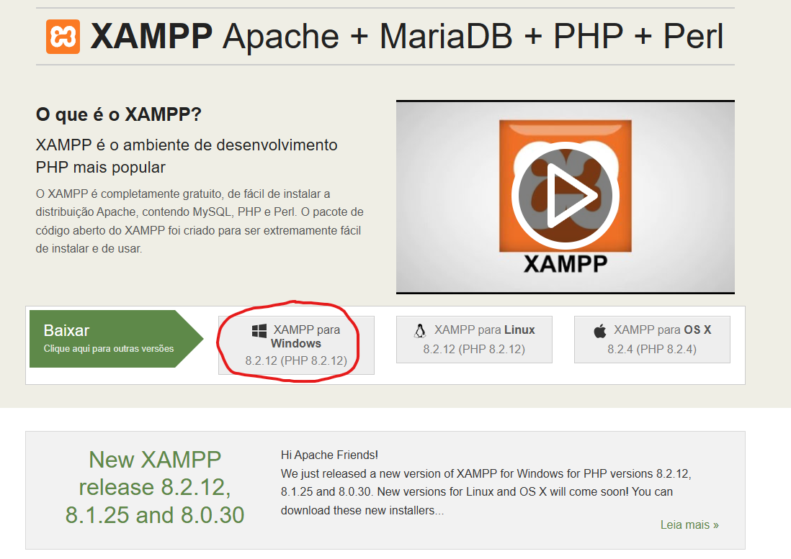
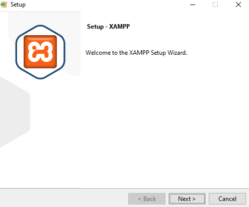
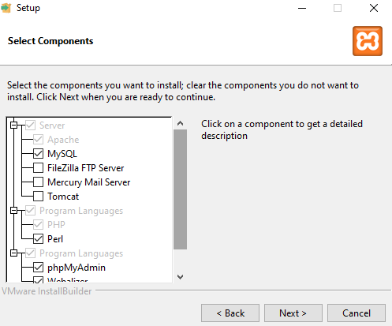
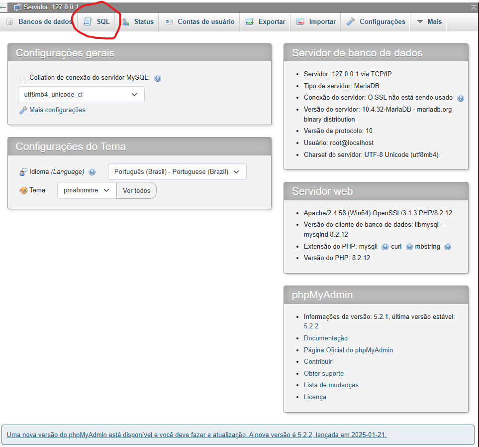

# Pi_Website0001
Site aplicativo do projeto integrador 1 na Univesp:  
Cliente TekTintas

### Página Inicial

* [Página do PI3](https://github.com/ProjetosIntegradores/Pi_Website0003)

* [Página do Render](https://gestao-pi-render.onrender.com/)

## Participantes do projeto:
```
Francisco Adilton de Oliveira  
Lucas Edson Santos Silva  
Yuri Chagas Sousa  
Fillipe de Oliveira Lemos  
Flavio Higor da Silva
```

## História e Desenvolvimento

O código do Projeto Integrador 1 foi desenvolvido no Visual Studio Code, MySQL Workbench, XAMPP... e agora Docker Desktop.

Essa é minha primeira vez criando um site com banco de dados. Tive diversas dificuldades durante o desenvolvimento, porém, com a ajuda de vídeos no YouTube*, repositórios do GitHub** e cursos desta faculdade***, consegui criar um banco de dados funcional.

A princípio, usei Python, mas depois de falhar algumas vezes tentando fazer sem instruções, troquei para PHP para melhor seguir outros desenvolvedores.

Apesar de o website ser simples, ele cumpre os requisitos do cliente e do projeto, que eram: 

**A solução para o cliente:** Criar um website que promovesse a loja e um aplicativo onde os seus usuários pudessem colocar suas informações (clientes do cliente) para futuras promoções e contatos.

**Já o objetivo do projeto era:** Desenvolvimento de um software com framework web que utilizasse noções de banco de dados, praticando controle de versão. 

Esse website possui um formulário que recebe e envia os dados para uma tabela em SQL que armazena e pode ser editada pelos administradores definidos pelo código. Além disso, esse projeto usou o GitHub para fazer o backup das várias versões e formas que o projeto teve.

Isso deve ser o suficiente para o PI1, mas vou continuar desenvolvendo este projeto para cumprir os requisitos de outro projeto.
Terminado de fazer o PI3, coloquei a parte do PI3 no render, o cliente achou ok, mas preferiu o do PI1.

## Instalação e Configuração

Primeiro, baixe o XAMPP em https://www.apachefriends.org/pt_br/index.html



Instale o XAMPP:  
Abra o instalador do XAMPP e pressione "Next":



Selecione as opções de MySQL e phpMyAdmin, depois pressione "Next":



Escolha o diretório onde o XAMPP será instalado:


Inicie o aplicativo XAMPP e ative o servidor localhost:


Crie o banco de dados do projeto:  
Abra o phpMyAdmin em um navegador com http://localhost/phpmyadmin



Copie o comando abaixo e execute o SQL:

```
CREATE DATABASE IF NOT EXISTS formulario_clientes CHARACTER SET utf8mb4 COLLATE utf8mb4_unicode_ci;
USE formulario_clientes;
CREATE TABLE IF NOT EXISTS clientes (
    id INT AUTO_INCREMENT PRIMARY KEY, 
    nome VARCHAR(255) NOT NULL,        
    email VARCHAR(255) NOT NULL,       
    telefone VARCHAR(20) NOT NULL,     
    endereco VARCHAR(255) NOT NULL,    
    data_nascimento DATE NOT NULL,     
    genero ENUM('masculino','feminino','outro') NOT NULL)
ENGINE=InnoDB DEFAULT CHARSET=utf8mb4 COLLATE=utf8mb4_unicode_ci;

INSERT INTO `clientes` (`id`, `nome`, `email`, `telefone`, `endereco`, `data_nascimento`, `genero`) VALUES 
('1', 'João Silva', 'joao@gmail.com', '11987654321', 'Rua A, 123', '1990-01-01', 'masculino');

CREATE TABLE IF NOT EXISTS usuarios (
    id INT AUTO_INCREMENT PRIMARY KEY,
    usuario VARCHAR(50) NOT NULL,
    senha VARCHAR(255) NOT NULL 
) ENGINE=InnoDB DEFAULT CHARSET=utf8mb4 COLLATE=utf8mb4_unicode_ci;

```

Para poder acessar o sistema, insira um usuário.  
Exemplo:

```
INSERT INTO `usuarios` (`id`, `usuario`, `senha`) VALUES ('1', 'admin', '123');
```

Os valores '1', 'admin', '123' podem ser alterados para as respectivas customizações do usuário.

Também há a opção de executar o `scriptCreateBD.sql`, mas será necessário instalar o MySQL Workbench.

Por fim, coloque todos os arquivos deste repositório dentro da pasta `xampp/htdocs`. O site agora deve estar acessível no navegador através do endereço:
http://localhost/PaginaInicial.html

## Referências e Citações
 *Gustavo Neitzke, Sistema com Login, Cadastro, Sessões e Listagem de dados com CRUD, https://www.youtube.com/playlist?list=PLSHNk_yA5fNjoIRNHV-3FprsN3NWPcnnK  
 **Lucas C. Achcar, Univesp PI_2, https://github.com/piunivespintegrador/pi2_univesp  
***UNIVESP, Eixo de Computação | Banco de Dados (2020.1),https://www.youtube.com/playlist?list=PLxI8Can9yAHeZcEzZElhxwsQTf9MaG6sS
