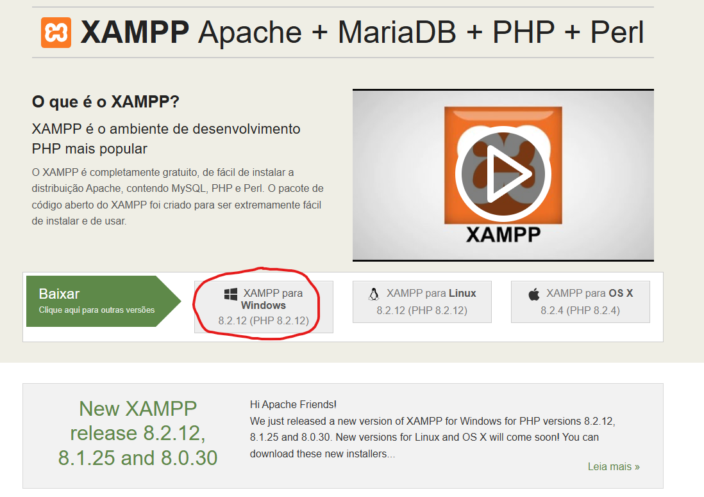
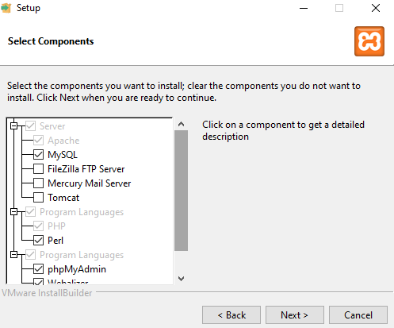
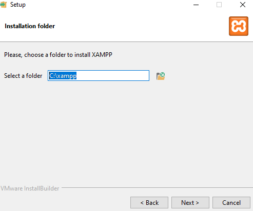
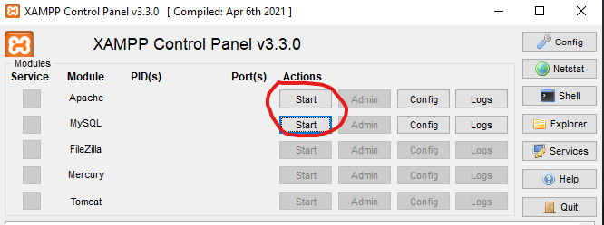

# Pi_Website0001
Site aplicativo do projeto integrador 1 no Univesp
Cliente TekTintas

## Link Demo:

### Página Inicial

* [Página do Cliente]()

## Participantes do projeto:
```
Francisco Adilton de Oliveira
Lucas Edson Santos Silva
Yuri Chagas Sousa
Fillipe de Oliveira Lemos
Flavio Higor da Silva
```
## Historia e Desenvolvimento

Código do projeto integrador 1 foi feito em VisualStudioCode, MySQL Workbench e XAMPP.

Essa e minha primeira vez criando um site com banco de dados, tive diversas dificuldades durante o desenvolvimento, porem com ajuda de videos no youtube, repertorios do github consegui fazer um banco de dados funcional.

A principio usei Python, mas depois de falhar algumas vezes tentando fazer sem instrucoes troquei para php com

## Instalação e Configuração
```
Primeiro Baixe Xampp: https://www.apachefriends.org/pt_br/index.html


Instale Xampp:




Inicie um servidor localhost no Xampp


Crie o banco de dados do projeto: aqui a dois metodos
Abra o phpMyAdmin em localhost/phpmyadmin


